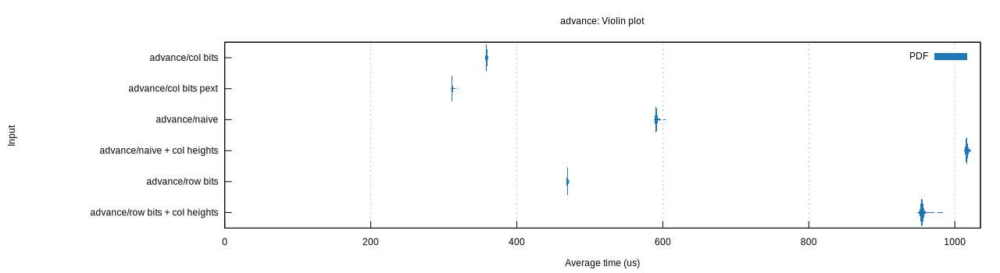

# board-repr-perft

Performance testing various board representations in Dellacherie's algorithm.

- `naive` represents the board as a 10x40 row-major array of `bool`s.
- `row bits` represents the board as row-major bitboard; an array of 40 `u16`s.
- `col bits` represents the board as a column-major bitboard; an array of 10 `u64`s.
- The column height variations augment the board with an array of column height values.
- The `pext` version of `col bits` uses the x86\_64 instruction `pext` to compute
  line clears, which is not available on all platforms.

Measured on an Intel Core i3-7100U. Compiled with `-C target-cpu=native`.

AMD CPUs before Zen 3 (the Ryzen 5000 series, released Q4 2020) have slow
`pext` implementations. As measured on an AMD Ryzen 7 3700X, the `pext` version
of the column bits benchmark is 45% slower for Dellacherie and 1063% slower for
advance.
